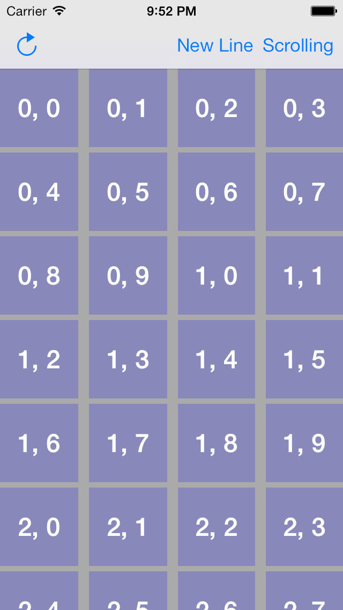
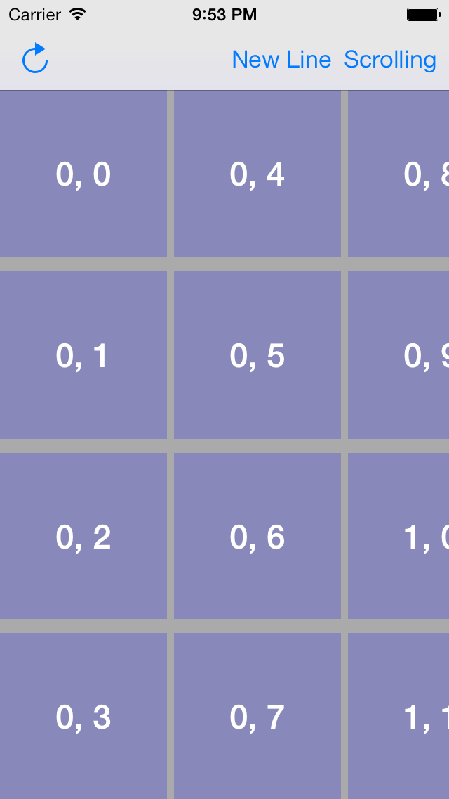

RDHCollectionViewGridLayout
===========================

Grid layout for UICollectionView.

If PSTCollectionView is being used, use the `RDHCollectionViewGridLayout/PST` pod.

This layout provides simple options for customisation of a collection view as a grid layout.
Supporting vertical and horizontal scrolling directions, the layout also takes care of left over pixels at the end of rows.
For example, a `UICollectionView` for a size of 320x300 scrolling vertically with 6 columns would normally mean each cell would be 53.3333 points wide.
This would mean the cells would be blurry due to it's frame sitting over non-integer pixel values.
`RDHCollectionViewGridLayout` takes care of this, and distributes these dirty extra pixels over the columns. This means the first 2 columns would have a cell width of 54 points, while the rest have a size of 53 points.

Documentation
-------------

[Online docs](http://cocoadocs.org/docsets/RDHCollectionViewGridLayout)

[Docset for xcode](http://cocoadocs.org/docsets/RDHCollectionViewGridLayout/xcode-docset.atom)

[Docset for Dash](dash-feed://http%3A%2F%2Fcocoadocs.org%2Fdocsets%2FRDHCollectionViewGridLayout%2FRDHCollectionViewGridLayout.xml)

Properties
----------

``` objective-c
/**
 * A vertical direction will constrain the layout by rows (lineItemCount per row), a horizontal direction by columns
 (lineItemCount per column).
 *
 * The default value of this property is UICollectionViewScrollDirectionVertical.
 */
@property (nonatomic, assign) UICollectionViewScrollDirection scrollDirection;

/**
 * Defines the size of the unconstrained dimension of the items. Simply, for vertical layouts this is the height of 
 the items, and for horizontal layouts this is the width of the items.
 * Setting this value to 0 will make layout set the dimension to the average of the other dimenion on the same line. 
 This is due to the layout taking account of dirty pixels, adding these extra pixels in the first X items on the line.
 * For example, if using a vertical scrollDirection and a lineItemCount of 5 when the collectionView has a width of 
 104, the first 4 items on every line will have a width of 21, and the last 20 (21 + 21 + 21 + 21 + 20 = 104), so the 
 height of the lines would be 21 (20.8 rounded).
 *
 * The default value of this property is 0.
 */
@property (nonatomic, assign) CGFloat lineDimension;

/**
 * Defines the maximum number of items allowed per line. Simply, for vertical layouts this is the number of columns, 
 and for horizontal layouts this is the number of rows. The layout accounts for adding the extra pixels to the first 
 X items on the line. Best case is that the useable width is exactly divisible by lineItemCount, worse case is that `
 (useable width) mod lineItemCount = (lineItemCount - 1)` and that the first `(lineItemCount - 1)` items are 1 pixel 
 bigger.
 *
 * The default value of this property is 4.
 */
@property (nonatomic, assign) NSUInteger lineItemCount;

/**
 * Defines the spacing of items on the same line of the layout. Simply, for vertical layouts this is the column 
 spacing, and for horizontal layouts this is the row spacing.
 *
 * The default value of this property is 0.
 */
@property (nonatomic, assign) CGFloat itemSpacing;

/**
 * Defines the line spacing of the layout. Simply, for vertical layouts this is the row spacing, and for horizontal 
 layouts this is the column spacing.
 *
 * The default value of this property is 0.
 */
@property (nonatomic, assign) CGFloat lineSpacing;

/**
 * To force sections to start on a new line set this property to YES. Otherwise the section will follow on on from 
 the previous one.
 *
 * The default value of this property is NO.
 */
@property (nonatomic, assign) BOOL sectionsStartOnNewLine;

````

Examples
--------


The following example is with a `lineSpacing` of 5 and `itemSpacing` of 10. Each section starts on a new line (`sectionsStartOnNewLine` is `YES`).


This is the same as the above but the `sectionsStartOnNewLine` is `NO`.




Horizontal scrolling




